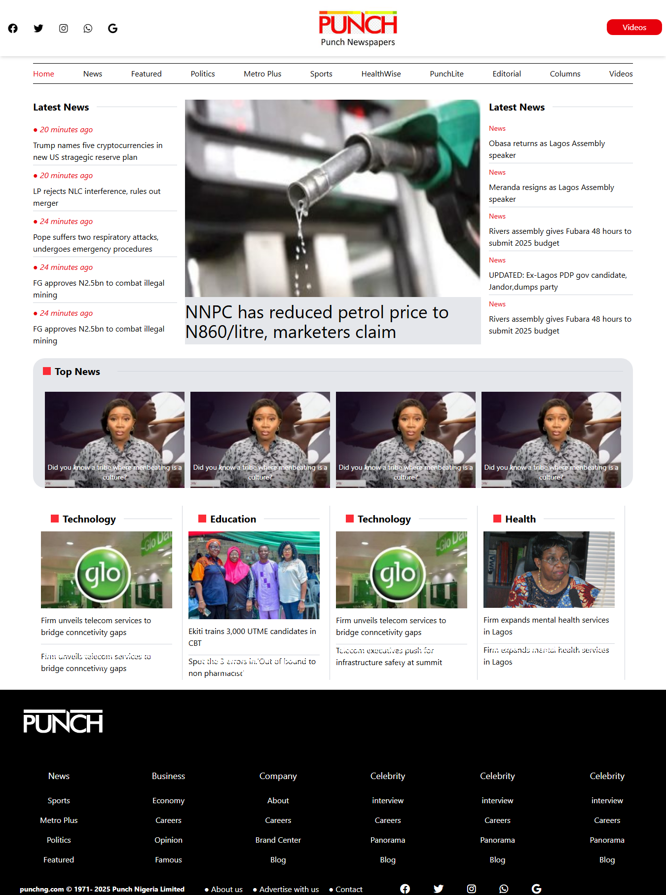

# Punch Homepage Clone

## This is a clone of the Punch homepage.A web page clone inspired by Punch Nigeria, providing the latest news, features, and articles. Built with HTML, CSS (Tailwind). The aim was to replicate the structure and styling of the official Punch homepage, focusing on layout, responsiveness and overall user interface design.

# Table of Contents
 - Features
 - Screenshot
 - Installation
 - Usage
 - Contributing

## Features
-Fixed Navigation Bar: The layout adjusts for different screen sizes, providing a good experience on both mobile and desktop.
- Fixed Navigation Bar: The navbar remains at the top of the screen when scrolling.
- Social Media Links: Integrated icons for social media platforms.
- Latest News Section: Displays the latest news articles with their respective timestamps.
- Dynamic Sections: Includes multiple sections like News, Featured, Politics, etc.
- Responsive Grid Layout

## Screenshot

## Built With
- HTML
- CSS
- Tailwind CSS

## Installation
To get a local copy up and running, follow these steps.
1. Clone the repository with git clone "https://github.com/Princessglory/Punch-Clone.git"
2. Go inside this repository by typing cd Punch-Clone

## Usage
1.Clone the project to your local machine.
2. Open index.html within your browser.

## Contributing
Contributions, issues and feature requests are welcome!
 Start by:
- Forking the project
- Cloning the project to your local machine
- cd into the project directory
- Run git checkout -b your-branch-name
- Make your contribution
- Push your branch up to your forked repository
- Open a Pull Request with a detailed description to the develop branch of the original project for a review.
